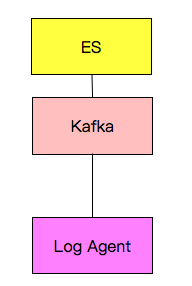

# ylogs 

基于GO语言搭建的可用于 **服务监控** 和 **用户行为采集**的日志系统。 
## 架构图

## 使用介绍

### logclient
客户端：

1.在app.conf文件中配置需要收集的日志点以及一些其他的信息。

2.运行main文件夹中的main.exe程序。

成功后，客户端根据配置信息并发收集多个日志点发送给服务端。

### logserve
服务端：

 1.在服务器上下载安装kafka、es、kibana

 2.运行main文件夹下的main.exe程序

## 扩展与定制
 
本项目在服务端首先使用了一个kafka消息队列来接受所有日志信息，然后只使用了ES搜索引擎和kibana订阅kafka的消息来实现可视化。

如果想要加入其他组件，只需订阅kafka的相关topic即可。

